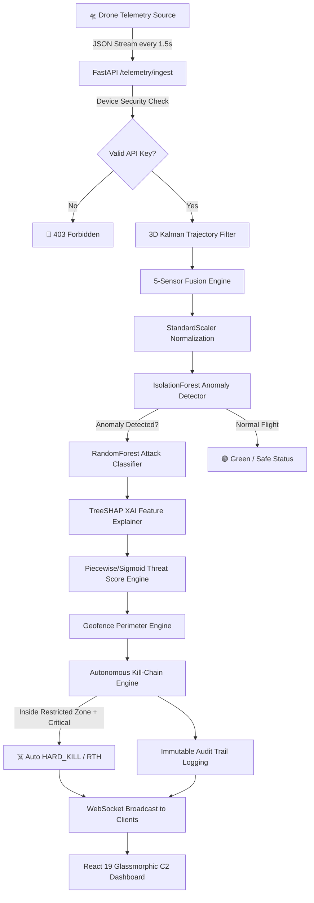

# SwarmGuard AI — Autonomous Drone Threat Intelligence Platform


SwarmGuard AI is an **Explainable Mission-Aware Autonomous Drone Threat Intelligence Platform** designed to detect, analyze, explain, and autonomously respond to cyber/RF attacks on UAV fleets in real-time.

Built for defense-tech operations, Counter-UAS research, and command-and-control (C2) tactical monitoring.

---

## 🏛️ System Architecture



Detailed architectural blueprints and documentation:
- 📑 [System Architecture (`docs/ARCHITECTURE.md`)](docs/ARCHITECTURE.md)
- 📑 [API Reference (`docs/API_REFERENCE.md`)](docs/API_REFERENCE.md)
- 📑 [Database Schema (`docs/DATABASE_SCHEMA.md`)](docs/DATABASE_SCHEMA.md)
- 📑 [Security Architecture (`docs/SECURITY.md`)](docs/SECURITY.md)

---

## ⚡ Core Defense Features

- 🤖 **Real Trained Machine Learning:** Powered by `IsolationForest` (unsupervised anomaly detection, `contamination=0.05`) and `RandomForestClassifier` (100% attack classification accuracy).
- 🧠 **Explainable AI (TreeSHAP):** Computes exact mathematical feature contributions (`speed`, `altitude`, `battery_drain_rate`) per anomaly alert.
- 🎯 **Deterministic Multi-Sensor Fusion:** Combines 3D AESA Radar, RF Spectrum Scanner, Optical AI (YOLO), Acoustic Propeller Spectrum, and 3D Kalman Filter without random jitter.
- ⚡ **High-Performance Database Indexing:** Optimized time-range queries (`created_at`, `drone_id`, `severity`, `status`) supporting instant DVR playback over millions of rows.
- 🗺️ **Tactical Radar & Geofencing:** Polygon and circular No-Fly zone perimeter enforcement with Ray-Casting algorithm.
- ☠️ **Autonomous Kill-Chain Mitigation:** Executes instant `HARD_KILL`, `RETURN_TO_HOME`, `EMERGENCY_LAND`, or `SWITCH_SAFE_MODE` protocols.
- ⏪ **DVR Historical Playback:** Slide backward in time to replay drone fleet trajectories step-by-step.
- 🛡️ **OWASP Defense Security:** Strict rate-limiting (`5/min` login), OWASP Nginx security headers (`CSP`, `X-Frame-Options`), non-root Docker `appuser`, and 4-tier RBAC (`Admin`, `Commander`, `Analyst`, `Observer`).

---

## 🛠️ Quick Start & Installation

### Option 1: Full-Stack Docker Compose (Recommended)

```bash
docker compose up --build
```

- **C2 Dashboard:** `http://localhost`
- **Backend API Docs:** `http://localhost:8000/docs`
- **Default Login:** Operator `admin` / Password `admin123`

---

### Option 2: Local Development Setup

#### 1. Backend Setup
```bash
python3 -m venv venv
source venv/bin/activate  # On Windows: venv\Scripts\activate
pip install -r backend/requirements.txt

# Generate training dataset & train ML models
python backend/scripts/generate_dataset.py
python backend/scripts/train_model.py

# Run FastAPI dev server
uvicorn backend.main:app --reload --port 8000
```

#### 2. Frontend Setup
```bash
cd frontend
npm install
npm run dev
```

---

## 🧪 Automated Testing

Run the pytest test suite covering AI inference, TreeSHAP, sensor fusion, Haversine math, and polygon geofencing:

```bash
./venv/bin/pytest backend/tests/ -v
```

---

## 📜 License & Credits

Built by the **SwarmGuard AI Engineering Team**. Released under the **MIT License**.
