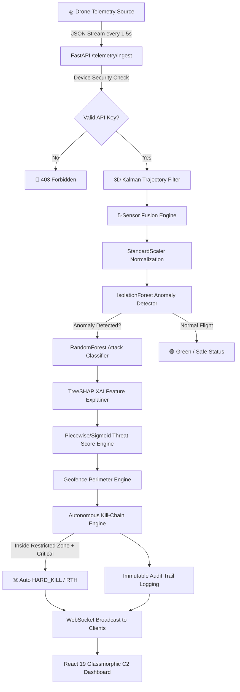
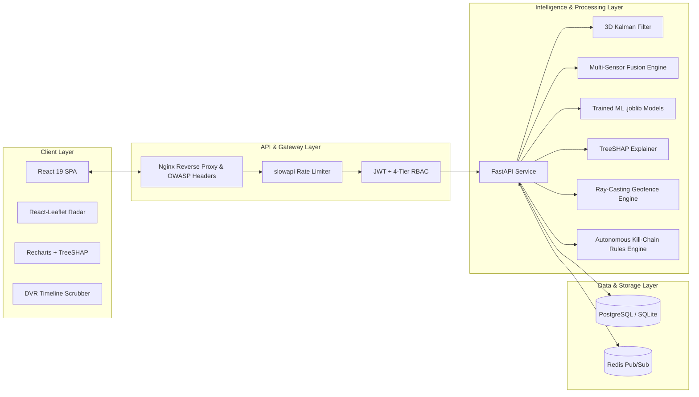

# SwarmGuard AI — System Architecture

**Document Version:** 2.0  
**Classification:** Defense-Tech C2 Architecture Specification  
**Status:** Approved

---

## Executive Overview

SwarmGuard AI is a real-time, defense-grade Counter-UAS (Unmanned Aerial System) Command & Control (C2) platform. It fuses multi-sensor telemetry (3D AESA Radar, RF Spectrum Analyzer, Optical AI YOLO, Acoustic Array, 3D Kalman Filter), detects airborne cyber threats via trained Machine Learning models (IsolationForest & RandomForest), provides Explainable AI (TreeSHAP) reasoning, and executes autonomous kill-chain mitigation protocols against rogue drone swarms.

---

## 1. High-Level Data Flow Diagram

---

## 2. Component Architecture

---

## 3. Core Processing Pipeline

### 3.1 Telemetry Ingestion & Filtering
1. **Device Authentication:** Incoming packets are validated via `x-drone-api-key` headers against configured defense secrets.
2. **Pydantic Validation:** Coordinates (`latitude`: -90° to 90°, `longitude`: -180° to 180°), altitude ($0 - 50,000$m), speed ($0 - 500$m/s), and battery ($0 - 100\%$) are strictly bounded.

### 3.2 3D Kalman State Estimation
- State Vector: $X = [\text{lat}, \text{lon}, \text{alt}, v_{\text{lat}}, v_{\text{lon}}, v_{\text{alt}}]^T$
- Constant velocity motion model detects sudden spatial position jumps ($> 150$m deviation) or uncommanded altitude crashes.

### 3.3 Real Machine Learning Inference
- **IsolationForest:** Trained with `n_estimators=200` and `contamination=0.05` to compute decision scores for unsupervised anomaly detection.
- **RandomForestClassifier:** Classifies anomalous flight behavior into specific threat vectors (`GPS_SPOOFING`, `JAMMING`, `DOS`, `REPLAY_ATTACK`).

### 3.4 TreeSHAP Explainability
- Calculates exact mathematical contribution of each telemetry feature to the threat score, answering *why* a drone was flagged.

### 3.5 Autonomous Kill-Chain Response
- Evaluates threat severity, geofence breaches, and signal loss ($> 30$ seconds).
- Executes autonomous mitigation (`HARD_KILL`, `RETURN_TO_HOME`, `EMERGENCY_LAND`, `SWITCH_SAFE_MODE`) and logs actions to an immutable `AuditLog` table.
