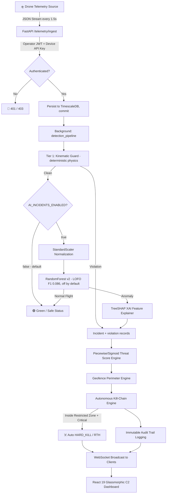
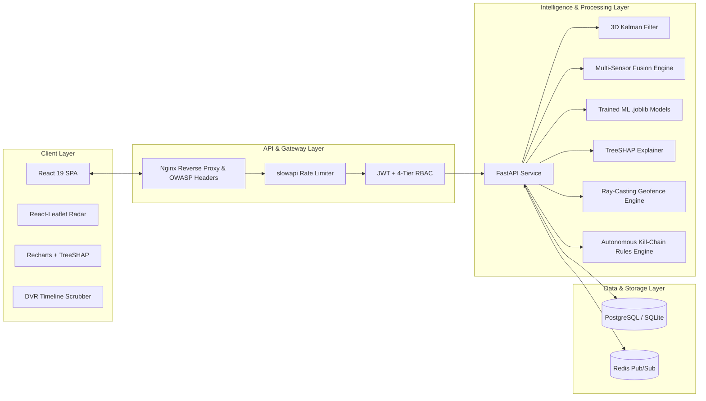

# SwarmGuard AI — System Architecture

**Document Version:** 2.0  
**Classification:** Defense-Tech C2 Architecture Specification  
**Status:** Approved

---

## Executive Overview

SwarmGuard AI is a real-time Counter-UAS (Unmanned Aerial System) Command &
Control (C2) platform. It ingests MAVLink telemetry, detects GPS spoofing and
jamming, raises explainable incidents to an operator dashboard, and provides a
kill-chain response framework.

**What is real, and what is scaffold** — stated up front because this document
previously implied capabilities the code does not have:

| Component | Status |
|---|---|
| MAVLink / REST telemetry ingest | **Real** |
| Kinematic guard (deterministic physics detection) | **Real**, live |
| 3D Kalman trajectory filter | **Real** — operates on ingested position |
| Multi-tenant isolation, RBAC, audit log | **Real** |
| Incident lifecycle, WebSocket feed, dashboard | **Real** |
| ML anomaly model (RandomForest on real PX4 flights) | **Trained, disabled** — LOFO F1 0.086, see README |
| 3D AESA Radar, RF Spectrum Analyzer, Optical AI (YOLO), Acoustic Array | **Scaffold only — no hardware connected** |

The sensor-fusion engine (`services/sensor_fusion.py`) implements the fusion
and weighting layer and accepts real measurements if a caller supplies them,
but `TelemetryPacket` carries no sensor fields, so on the live path radar
cross-section, RF signal strength, optical class, and acoustic frequency are
all *derived from the telemetry packet by formula*. A fused confidence score
built that way restates the packet; it does not corroborate it. Treat it as an
integration point awaiting hardware.

---

## 1. High-Level Data Flow Diagram

---

## 2. Component Architecture

---

## 3. Core Processing Pipeline

### 3.1 Telemetry Ingestion & Filtering
1. **Device Authentication:** Incoming packets are validated via `x-drone-api-key` headers against configured defense secrets.
2. **Pydantic Validation:** Coordinates (`latitude`: -90° to 90°, `longitude`: -180° to 180°), altitude ($0 - 50,000$m), speed ($0 - 500$m/s), and battery ($0 - 100\%$) are strictly bounded.

### 3.2 3D Kalman State Estimation
- State Vector: $X = [\text{lat}, \text{lon}, \text{alt}, v_{\text{lat}}, v_{\text{lon}}, v_{\text{alt}}]^T$
- Constant velocity motion model detects sudden spatial position jumps ($> 150$m deviation) or uncommanded altitude crashes.

### 3.3 Detection

**Tier 1 — kinematic guard (`services/kinematic_guard.py`). This is what runs.**
Deterministic physical-plausibility checks: GNSS-implied ground speed against
the airframe envelope, GNSS speed against airframe-reported speed, climb rate,
and satellite-count collapse. No training data, no false positives on
physically valid flight, and every alert carries observed value, threshold, and
exceedance factor.

**Tier 2 — ML anomaly model. Trained but disabled** (`AI_INCIDENTS_ENABLED=false`).

- **RandomForestClassifier (v2):** binary GPS Spoofing vs Normal, trained on
  real PX4 ULog flights. Under leave-one-flight-out validation it scores
  **F1 0.086 with a 0.862 false-positive rate** — it does not generalize across
  flights, so it does not raise incidents. Full analysis in the root README.
- **IsolationForest (v1):** legacy, trained on synthetic data. Retained only so
  `MODEL_VERSION=v1` remains loadable.

### 3.4 TreeSHAP Explainability
- Calculates the mathematical contribution of each telemetry feature to the
  model's score, answering *why* a drone was flagged. Applies to Tier 2 only;
  Tier 1 explains itself through its violation records, which carry the
  arithmetic rather than an attribution.
- Attributions are labelled from the loaded model's own feature list, so a
  retrained model cannot mislabel them against a stale hardcoded list.

### 3.5 Autonomous Kill-Chain Response
- Evaluates threat severity, geofence breaches, and signal loss ($> 30$ seconds).
- Executes autonomous mitigation (`HARD_KILL`, `RETURN_TO_HOME`, `EMERGENCY_LAND`, `SWITCH_SAFE_MODE`) and logs actions to an immutable `AuditLog` table.
