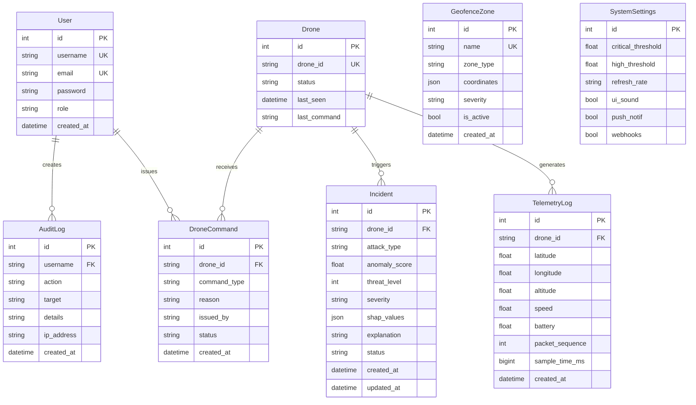

# SwarmGuard AI — Database Schema Documentation

**Supported Engines:** PostgreSQL 16 (Production), SQLite 3 (Development)

---

## Entity-Relationship (ER) Diagram

---

## Timestamps

Every `datetime` column above is `timestamp with time zone`, an absolute
instant (migration `m3b4c5d6e7f8`). They were `timestamp without time zone`
holding UTC by convention, which nothing enforced and which left every value
in an API response without an offset. Connections pin their session to UTC, so
a bare timestamp handed to the driver still means UTC whatever the server is
configured for.

## High-Performance Database Indexes

| Table | Index Column(s) | Type | Rationale |
|:---|:---|:---:|:---|
| `telemetry_logs` | `created_at` | B-Tree | Optimizes historical time-window queries for DVR playback |
| `telemetry_logs` | `drone_id` | B-Tree | Fast lookup for specific drone telemetry histories |
| `incidents` | `created_at` | B-Tree | Fast sorting for recent incident feeds |
| `incidents` | `severity` | B-Tree | High-speed filtering by `CRITICAL` / `HIGH` severity |
| `incidents` | `status` | B-Tree | High-speed filtering by `OPEN` / `RESOLVED` status |
| `drones` | `drone_id` | Unique B-Tree | Instant drone registration and lookup |
| `users` | `username`, `email` | Unique B-Tree | Fast authentication lookups |
